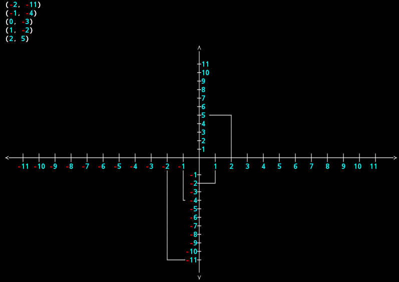

# XYAxis
simple tool to paint axis x and y
> this tool 👇



Install:
```
git clone https://github.com/G705-Ghilan/XYAxis
python XYAxis -2 3 s**3
```

example:
```
python XYAxis -1 1 s
python XYAxis -2 3 s//2-5
```

